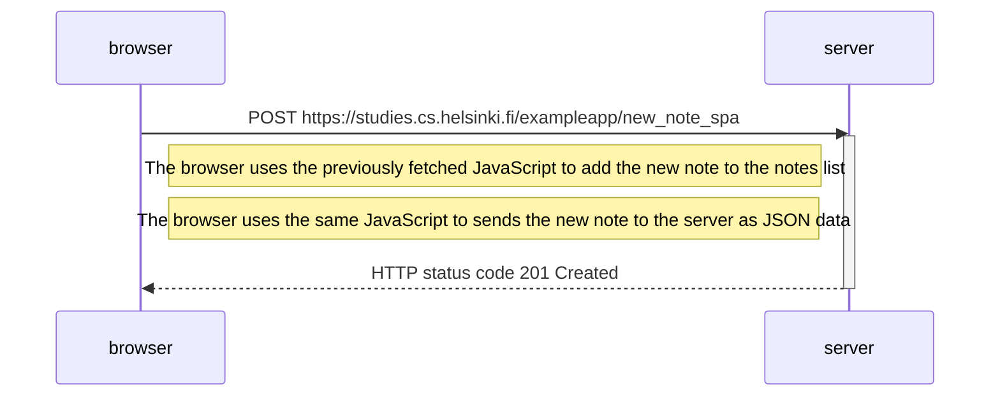

```mermaid
  sequenceDiagram
    participant browser
    participant server
    
    browser->>server: POST https://studies.cs.helsinki.fi/exampleapp/new_note_spa
    activate server
    Note right of browser: The browser uses the previously fetched JavaScript to add the new note to the notes list
    Note right of browser: The browser uses the same JavaScript to sends the new note to the server as JSON data
    server-->>browser: HTTP status code 201 Created
    deactivate server
```
